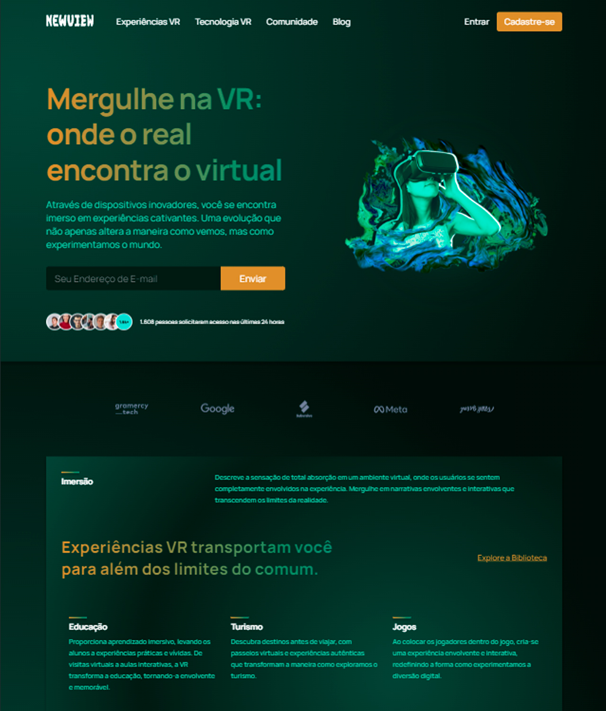
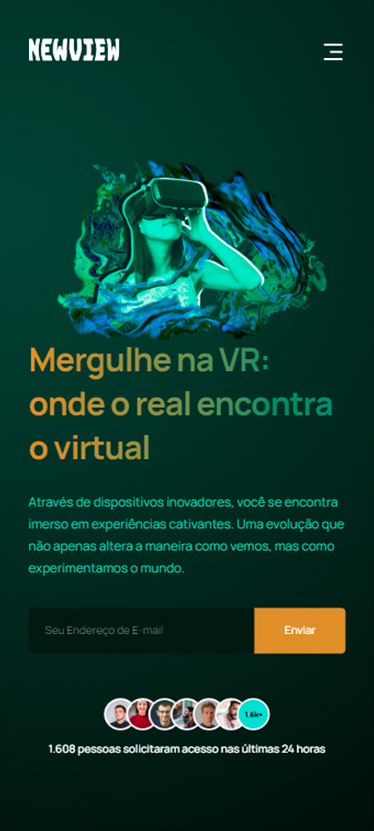

# New View VR


## Overview

Web development project in which the idea was to create a landing page for a fictional virtual reality technology company called NewViewVR. The fully responsive website has several call-to-action buttons and a menu for navigation.

Still in the development process...

[View Project](https://newview.vercel.app/)

## :man_mechanic: Linguagens e Ferramentas

- Javascript
- React
- Sass
- Git

## :paintbrush: Layout

### :desktop_computer: Desktop



### :iphone: Mobile



## :computer: Dependencies

```shell
# 1. Clone the project

git clone https://github.com/dev-andreola/newview

# 2. Install dependencies

npm install

# 3. Run live server

npm start
```

## :triangular_flag_on_post: Contribute to the project

The content **may contain some errors** as I am a student and the repository is constantly evolving.

Contributions are what make the open source community such an amazing place to learn, inspire, and create. Any contributions you make are **greatly appreciated**.

If you have any corrections or improvements that would make this better, please fork the repo and create a pull request.

1. Fork the Project
2. Create your Feature Branch (`git checkout -b feature/Feature`)
3. Commit your Changes (`git commit -m 'Add some Feature'`)
4. Push to the Branch (`git push origin feature/Feature`)
5. Open a Pull Request
